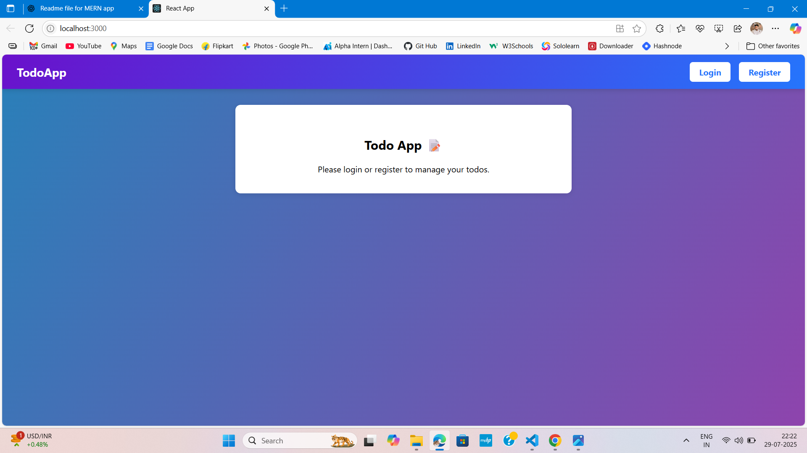
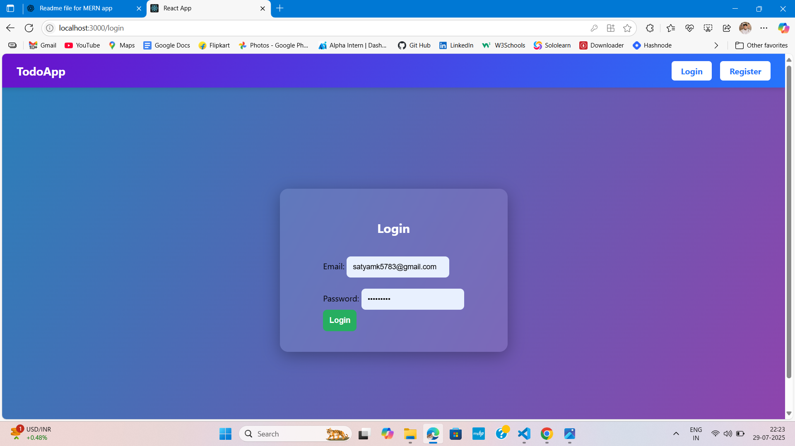
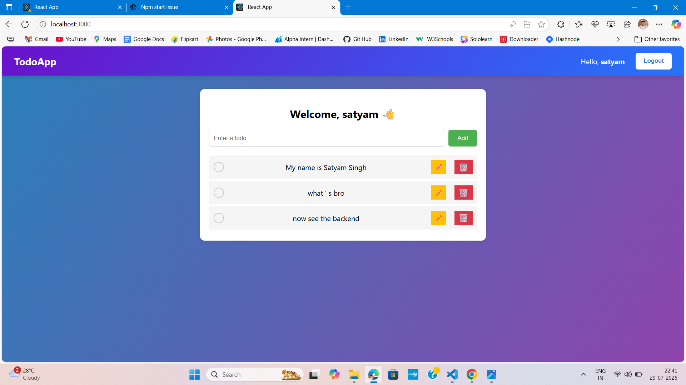

📝 MERN Stack TODO App
A full-stack TODO application built using the MERN stack: MongoDB, Express.js, React.js, and Node.js.
It allows users to manage daily tasks with add, edit, delete, and complete features — all in a clean, responsive UI.

📁 Project Structure
bash
Copy
Edit
TODO-Web/
│
├── frontend/ # React frontend
├── backend/ # Express backend
├── .gitignore
├── package.json
└── README.md

⚙️ Technologies Used
Frontend: React.js, CSS/Tailwind (optional), Axios

Backend: Node.js, Express.js, MongoDB, Mongoose

Tools: Git, VS Code

✅ Features
Add new tasks

Edit existing tasks

Delete tasks

Mark tasks as completed

Responsive UI

RESTful API integration

📦 Installation
Step 1: Clone the repository
bash
Copy
Edit
git clone https://github.com/Satyamkumar5783/TODO-Web.git
cd TODO-Web
Step 2: Install dependencies

For backend
cd backend
npm install

For frontend
cd ../frontend

npm install
▶️ Run the App
Start the backend server
cd backend
npm run server

# or

nodemon server.js

Start the frontend
cd ../frontend
npm start
Frontend will run on: http://localhost:3000

Backend will run on: http://localhost:5000 (or your custom port)

🖼️ Screenshots

### 🏠 Home Page

### 🔑 Login page

### ✅ Add Todo

🌐 Deployment
You can deploy this project using:

Frontend: Vercel or Netlify

Backend: Render, Railway, Cyclic, or your own VPS

🙋‍♂️ Author
Satyam Kumar
GitHub: https://github.com/Satyamkumar5783
